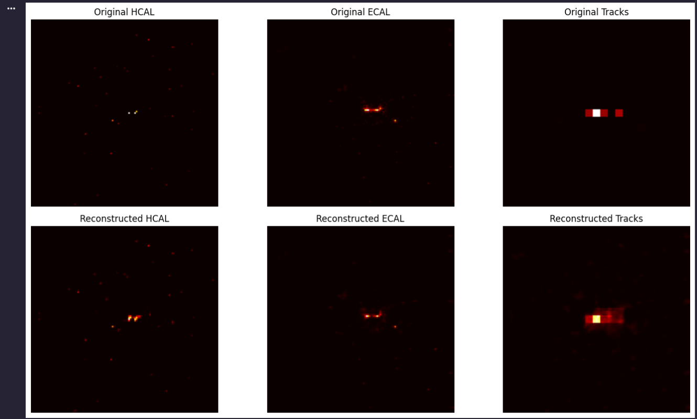
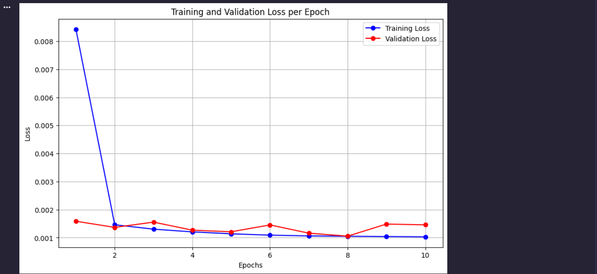
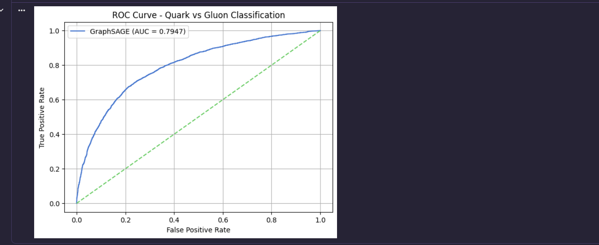
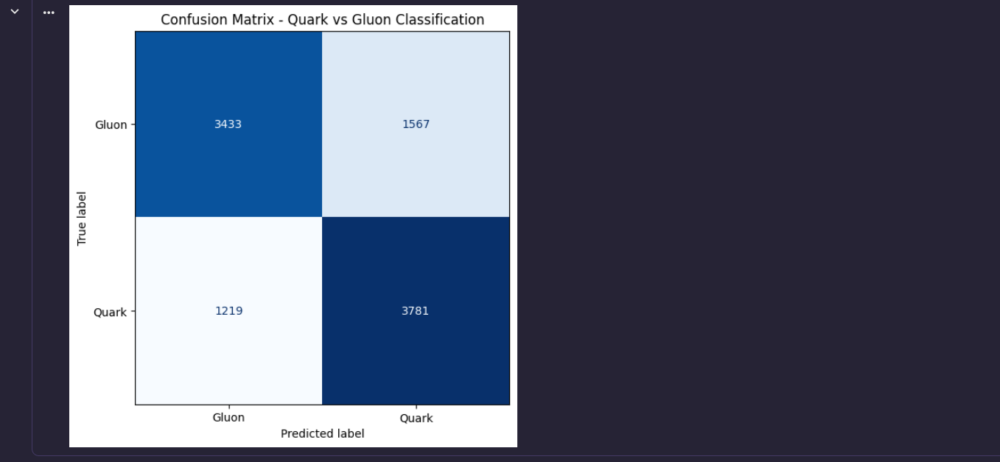
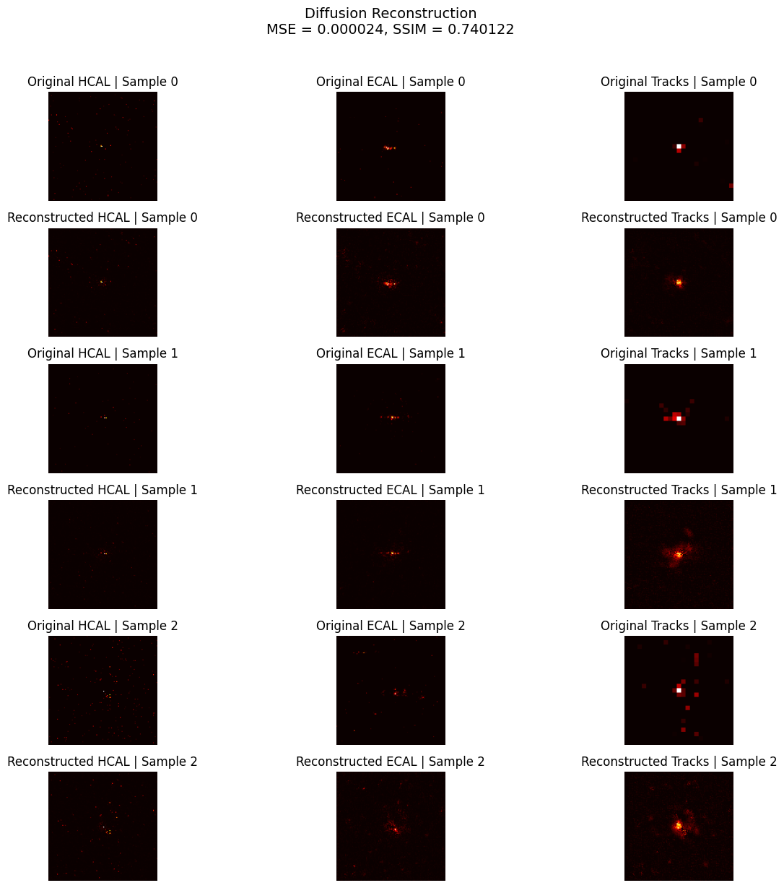

# Genie-GSoC2026

Quark/gluon jet modeling notebooks for three complementary tasks:

1. `task1`: Please train an auto-encoder to learn the representation based on three image channels (ECAL, HCAL and Tracks) for the dataset. Please show a side-by-side comparison of original and reconstructed events.

2. `task2`: Please choose a graph-based GNN model of your choice to classify (quark/gluon) jets.
 Convert the images into a point cloud dataset by only considering the non-zero pixels for every event.
 Cast the point cloud data into a graph representation by coming up with suitable representations for nodes and edges. Train your model on the obtained graph representations of the jet events.
  Discuss the resulting performance of the chosen architecture.

3. `task3`: Use a Diffusion Network model to represent the events in task 1. Please show a side-by-side comparison of the original and reconstructed events and an appropriate evaluation metric of your choice that estimates the difference between the two.

## Repository Layout
```text
task1/
  task1 .ipynb
  performance/
    metric.png
    reconstruct.png

task2/
  task2 .ipynb
  performance/
    Training_val_loss .png
    confusion_matrix.png
    ROC_curve.png

task3/
  task3 .ipynb
  performance/
    recon.png
```

## Task 1: Jet Image Autoencoders

Notebook: [task1/task1 .ipynb](task1/task1%20.ipynb)

This notebook studies sparse calorimeter jet images and reconstructs them with two autoencoders:

- `JetAutoencoder`: a shallow baseline with `Conv2d`, `MaxPool2d`, and `ConvTranspose2d`
- `ConvJetAutoencoder`: a deeper convolutional autoencoder with `BatchNorm2d`, `LeakyReLU`, strided convolutions, and a larger bottleneck
- `weighted_loss(recon, target, alpha=10.0, threshold=1e-6)`: emphasizes non-zero pixels to avoid trivial near-zero reconstructions on highly sparse images
- `evaluate(model, loader)`: computes validation loss for the improved autoencoder

### What The Notebook Does

- Loads jet images from the HDF5 dataset
- Explores class balance, `pt`, `m0`, and channel sparsity
- Trains a baseline autoencoder with plain `MSELoss`
- Trains an improved autoencoder with log normalization, padding `125x125 -> 128x128`, and weighted reconstruction loss
- Compares original and reconstructed detector channels side by side across ECAL, HCAL, and Tracks

### Metrics

Improved autoencoder training logs:

| Metric | Value |
|---|---:|
| Epochs | 10 |
| Final train loss | 0.001030 |
| Final val loss | 0.001458 |
| Best val loss | 0.001054 |

Key takeaway:

- The baseline autoencoder collapses toward near-zero outputs on sparse data
- The improved model captures the sparse jet structure much better after weighted loss and stronger encoder/decoder capacity

### Visualizations

- Original vs reconstructed channels: `HCAL`, `ECAL`, `Tracks`
- Training vs validation loss curve for the improved autoencoder





## Task 2: Jets As Graphs

Notebook: [task2/task2 .ipynb](task2/task2%20.ipynb)

This notebook converts sparse jet images into graphs and trains a graph neural network for binary quark/gluon classification.

### Core Functions And Classes

- `Jets_to_Point_Cloud(jet, max_nodes=MAX_NODES)`: converts non-zero calorimeter pixels into point-cloud nodes with `[x, y, intensity, channel]`
- `knn_edge_index(position, k=8)`: builds k-nearest-neighbor edges in spatial coordinates
- `point_cloud_to_graph(points, label, k=8)`: wraps node features, edges, and label into a `torch_geometric.data.Data` graph
- `JetGraphSAGE`: GraphSAGE classifier with three `SAGEConv` layers, global mean pooling, and an MLP head
- `get_test_probs_and_labels(model, loader, device)`: collects prediction scores and labels for evaluation
- `plot_loss(train_losses, val_losses)`: visualizes training history

### What The Notebook Does

- Converts jet images to sparse point clouds by extracting only non-zero pixels
- Builds kNN graphs with up to 400 nodes per jet, where each node carries `[x_norm, y_norm, intensity, channel]` as features
- Trains a GraphSAGE classifier using `BCEWithLogitsLoss`
- Evaluates classification quality with ROC-AUC, confusion matrix, and loss curves
- Discusses the performance of the GraphSAGE architecture on the quark/gluon separation task

### Metrics

| Metric | Value |
|---|---:|
| Test ROC-AUC | 0.7912 |
| Final train loss | 0.5553 |
| Final val loss | 0.5508 |
| Epochs | 10 |
| Test samples | 10,000 |

Notebook observation:

- The model identifies quarks better than gluons in the final confusion matrix

### Visualizations

- Training and validation loss curve
- ROC curve
- Confusion matrix






## Task 3: Diffusion Reconstruction

Notebook: [task3/task3 .ipynb](task3/task3%20.ipynb)

This notebook implements a denoising diffusion probabilistic model for jet-image reconstruction and shows a side-by-side comparison of original and reconstructed events with quantitative evaluation metrics.

### Core Functions And Classes

- `Beta_schedule(time)`: defines the noise schedule
- `forwardprocess(image, time)`: applies the forward diffusion process
- `Linear_Noise_Scheduler`: precomputes and serves diffusion coefficients for forward and reverse steps
- `get_time_embedding(time_steps, t_emb_dim)`: builds sinusoidal timestep embeddings
- `DownBlock`, `MidBlock`, `UpBlock`: U-Net building blocks with residual convolutions, time injection, and attention
- `Unet`: predicts the noise at each timestep
- `weighted_diffusion_loss(pred_noise, true_noise, x0, alpha=8.0, threshold=1e-6)`: focuses learning on informative non-zero regions
- `train_one_epoch()` and `evaluate()`: train/validate the diffusion model
- `reverse_denoise_from_timestep(x0, t_start=5)`: reconstructs an image by reverse denoising from a lightly noised sample
- `mse_metric(x_true, x_pred)` and `compute_ssim_batch(x_true, x_pred)`: reconstruction evaluation metrics

### What The Notebook Does

- Preprocesses the same jet images used in Task 1
- Trains a U-Net noise predictor with a linear beta schedule
- Reconstructs jets by reverse denoising and shows a side-by-side comparison of original vs reconstructed events across all three detector channels
- Evaluates the final reconstructions with MSE and SSIM as quantitative difference metrics

### Metrics

Training summary:

| Epoch | Train Loss | Val Loss |
|---|---:|---:|
| 1 | 0.035946 | 0.004720 |
| 2 | 0.003875 | 0.003129 |
| 3 | 0.002844 | 0.002265 |
| 4 | 0.002536 | 0.002405 |
| 5 | 0.002403 | 0.002601 |

Final reconstruction metrics:

| Metric | Value |
|---|---:|
| MSE | 0.000024 |
| SSIM | 0.740122 |

### Visualizations

- Reconstructed test samples across the three detector channels
- Reconstruction figure annotated with final `MSE` and `SSIM`



## Summary

| Task | Original Task Description | Main Model | Main Metrics |
|---|---|---|---|
| Task 1 | Train an autoencoder on ECAL, HCAL, Tracks channels and show original vs reconstructed events | Convolutional autoencoder | Best val loss `0.001054` |
| Task 2 | Classify quark/gluon jets with a graph-based GNN using point clouds from non-zero pixels | GraphSAGE on kNN jet graphs | ROC-AUC `0.7912` |
| Task 3 | Use a diffusion network to reconstruct jet events with side-by-side comparison and evaluation metric | DDPM with U-Net backbone | MSE `0.000024`, SSIM `0.740122` |